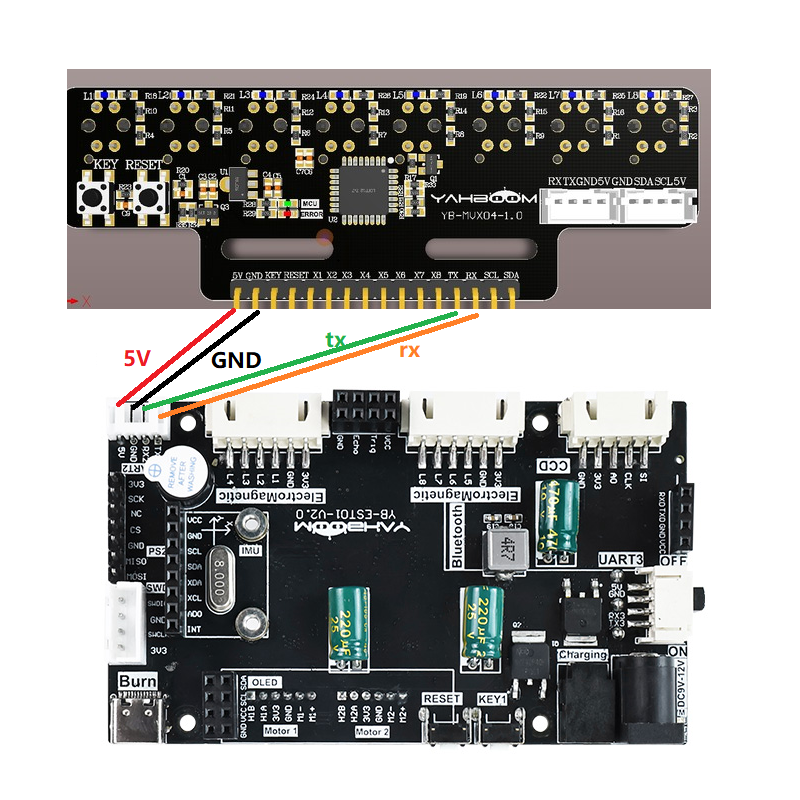

# STM32平衡小车

## 1.实验准备
1. 知识储备
- 具有有良好的编程能力(主要是C语言)
- 对stm32的架构比较熟悉

2. 材料准备
- STM32平衡小车 *1
- 八路循迹模块 *1
- 12V电池 *1
- 杜邦线若干

## 2.小车接线
 
**平衡小车和红外传感器的接线 (此例程使用串口通信)**
|**平衡小车**|   红外传感器   |
|:-----------:|:-------------:|
|    TX2      |     RX      |
|    RX2      |     TX      |
|    5V      |     5V      |
|    GND     |     GND     |

如图所示




## 主要程序
```C

int main(void)
{	
	
	Mid_Angle = -1; //根据小车来获取 Obtain based on the car
	
	
	bsp_init();
	
	MPU6050_EXTI_Init();					//此中断服务函数放到最后 This interrupt service function is placed last
	
	while(!Key1_State(1));
	send_control_data(0,0,1);//发送接收数字型数据
	Stop_Flag = 0; //开始控制 Start controlling

//	OLED_Draw_Line("start tracking!", 1, true, true); 
	
	delay_time(10);//延迟100ms delay 100ms
	
	while(1)
	{
		
		if(g_new_package_flag == 1)
		{
			g_new_package_flag = 0;
		}
		
	}
}

```
此工程使用了外部中断中断去根据红外探头的的值(每5ms)，进行巡线的PID处理,从而能在黑线白底的地图是完成巡线。

在app_irtrackin.c里面有一个调节pid巡线的参数，如果想要增加或减少速度 优化效果，可以调节里面的宏定义值
```C

#define IRTrack_Trun_KP (250) //P
#define IRTrack_Trun_KI (0.0001) //I
#define IRTrack_Trun_KD (0.05) //D

#define Track_Speed 15			  //巡线速度
```
- IRTrack_Trun_KP:pid巡线的P值
- IRTrack_Trun_KI：pid巡线的I值
- IRTrack_Trun_KD：pid巡线的D值
- IRR_SPEED：巡线的速度


## 实验现象：
在确保接线和安装无误的前提下，8路巡线模块进行的校准后，按下key1的按键就能开始巡线了。
**如果8路模块探头还无法正常检测黑白线，需要等待模块正常工作后，再按下key1键**
**如果地板是黑色的，需要把一张白纸放到我们的地图下方，盖住黑色，主要原因是地图的材质比较透光，对8路巡线传感器的影响较大。**
