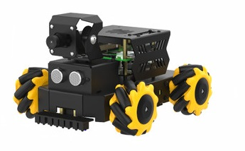

# RaspbotV2小车巡线

[toc]


## 1.实验准备
1. 材料准备
- RaspbotV2小车 *1
- 八路循迹模块 *1
- 7.4V电池 *1
- 杜邦线若干
- M3铜柱、M3螺丝若干


## 2.小车接线
把小车组装好后，如下图所示



### 2.1 Roboduino和红外传感器的接线 (此例程使用串口通信)
|**RaspbotV2**|   红外传感器   |
|:-----------:|:-------------:|
|     TX      |       RX      |
|     RX      |       TX      |
|     5V      |       5V       |
|     GND     |       GND      |

**如果线不过长，可以用一个ch340接到树莓派的usb接口上，然后巡线模块接到ch340上，在把tracking.py的17行注释，18行取消注释。**


**要把PID.py和tracking.py要放到小车的镜像里面的同一个文件夹下才能运行，否则会报以下环境找不到的第三方库的错误，可以根据小车提供的资料进行安装对应的库，解决报错。**
## 主要程序
```python
#主函数
if __name__ == "__main__":
    print("start it")
    
    try:
        while True:
            usart_deal()
    except KeyboardInterrupt:
        pass
    finally:
       #停止运动
        bot.Ctrl_Car(0,1,0) #L1电机 后退 0速度
        bot.Ctrl_Car(1,1,0) #L2电机 后退 0速度
        bot.Ctrl_Car(2,1,0) #R1电机 后退 0速度
        bot.Ctrl_Car(3,1,0) #R2电机 后退 0速度
        ser.write(bytes("$0,0,0#",'utf-8'))

```
主函数就是根据红外探头的的值，进行巡线的PID处理,从而能在黑线白底的地图是完成巡线。

在tracking.py里面有一个调节pid巡线的参数，如果想要增加或减少速度 优化效果，可以调节里面的宏定义值
```python
#初始化pid
P = 6
I = 0
D = 0
middle_error = 0 #中心
go_speed = 20

```
- P:pid巡线的P值
- I:pid巡线的I值
- D:pid巡线的D值
- go_speed：巡线的速度


# 实验现象：
在确保接线和安装无误的前提下，8路巡线模块进行的校准后，启动以下的命令就能开始巡线了。
```shell
python3 tracking.py
```
**如果8路模块探头还无法正常检测黑白线，需要等待模块正常工作后，再启动命令。**
