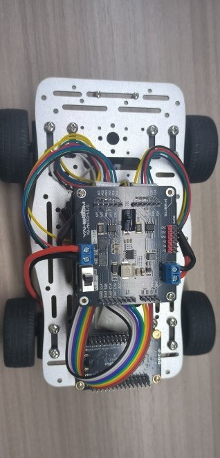
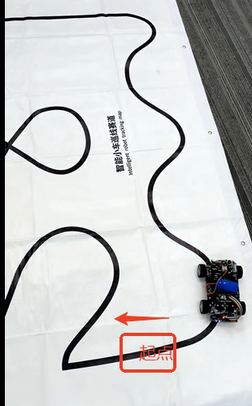

# STM32-mini底盘小车

[toc]

## 1.实验准备
1. 知识储备
- 具有有良好的编程能力(主要是C语言)
- 对stm32的架构比较熟悉

2. 材料准备
- 智能小车mini底盘 *1
- stm32F103RCT6 *1 (需要亚博板的板子，其它的板子，需要改源码)
- 亚博版的双路电机驱动板 *2 (其它的电机驱动板可能不适合本教程提供的源码，需自己移植)
- 八路循迹模块 *1
- 310电机 *4
- 7.4V电池 *1
- 杜邦线若干
- M3铜柱、M3螺丝若干


## 2.小车接线
把小车组装好后，如下图所示




### 2.1 stm32和双路驱动板接线部分
1. stm32F103RCT6 和双路电机板（最上层板子）的接线
|**STM32RCT6**|最上层双路电机板|
|:-----------:|:-------------:|
|     PA11    |      AIN1      |
|     PA8     |      AIN2      |
|     PC6     |      BIN1      |
|     PC7     |      BIN2      |
|     3V3     |      3V3      |
|     GND     |      GND      |
|     PA0     |      E1A      |
|     PA1     |      E1B      |
|     PA15    |      E2A      |
|     PB3     |      E2B      |
| 5V | 5V |

2. stm32F103RCT6 和双路电机板（最下层板子）的接线
|**STM32RCT6**|最下层双路电机板|
|:-----------:|:-------------:|
|     PB0     |      AIN1      |
|     PB1     |      AIN2      |
|     PC8     |      BIN1      |
|     PC9     |      BIN2      |
|     3V3     |      3V3      |
|     GND     |      GND      |
|     PA7     |      E1A      |
|     PA6     |      E1B      |
|     PB7     |      E2A      |
|     PB6     |      E2B      |

3. 最上层的电机驱动板子是接靠近红外传感器的两轮子的电机（即前面的电机），

   motorA--->左电机、motorB--->右电机

4. 最下层的电机驱动板子是接远离红外传感器的两轮子的电机（即后面的电机），

  motorA--->左电机、motorB--->右电机


### 2.2 STM32RCT6和红外传感器的接线 (此例程使用串口通信)
|**STM32RCT6**|   红外传感器   |
|:-----------:|:-------------:|
|     PC10     |       RX      |
|     PC11     |       TX      |
|    不接    | VCC和最上层双路电机板5V接口相连 |
|     GND     |       GND     |


## 主要程序
```C
int main(void)
{		
	
	//硬件初始化
	BSP_init();
	
	while(!Key1_State(1));//等待按键按下
	
	TIM6_Init();//定时器6初始化
		
	send_control_data(0,0,1); //设置只接收数值型数据
	
	while(1)
	{
		LineWalking(); //加快响应
	}
}

```
主函数就是根据红外探头的的值，进行巡线的PID处理,从而能在黑线白底的地图是完成巡线。

在app_irtrackin.c里面有一个调节pid巡线的参数，如果想要增加或减少速度 优化效果，可以调节里面的宏定义值
```C

#define IRTrack_Trun_KP (490) //P
#define IRTrack_Trun_KI (0.0001) //I
#define IRTrack_Trun_KD (5) //D

#define IRR_SPEED 			  400  //巡线速度
```
- IRTrack_Trun_KP:pid巡线的P值
- IRTrack_Trun_KI：pid巡线的I值
- IRTrack_Trun_KD：pid巡线的D值
- IRR_SPEED：巡线的速度


**当要检测电机接线是否正确，可以给一个正值速度，然后巡线PID的值置0**，如果接线正确，按下RCT6开发板上的key按键后，小车是会往前跑的，4个电机都会往前。

## 实验现象：
在确保接线和安装无误的前提下，8路巡线模块进行的校准后，（如果使用的是教程一样的地图）需要把小车放到如下图的起点示意图下，按下key1的按键就能开始巡线了。
**如果8路模块探头还无法正常检测黑白线，需要等待模块正常工作后，再按下key1键**
**如果地板是黑色的，需要把一张白纸放到我们的地图下方，盖住黑色，主要原因是地图的材质比较透光，对8路巡线传感器的影响较大。**


