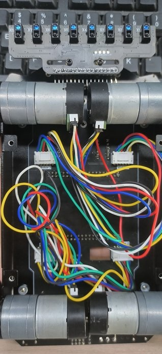
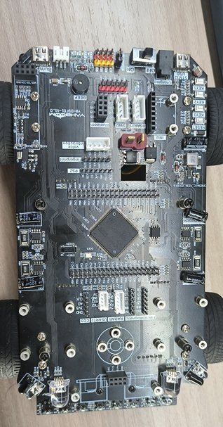
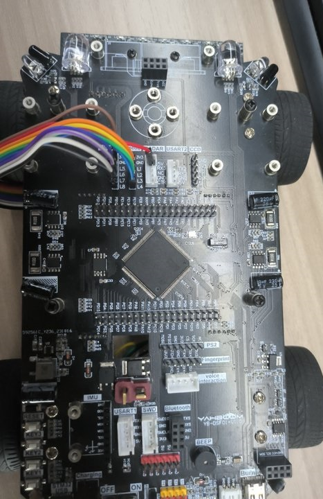
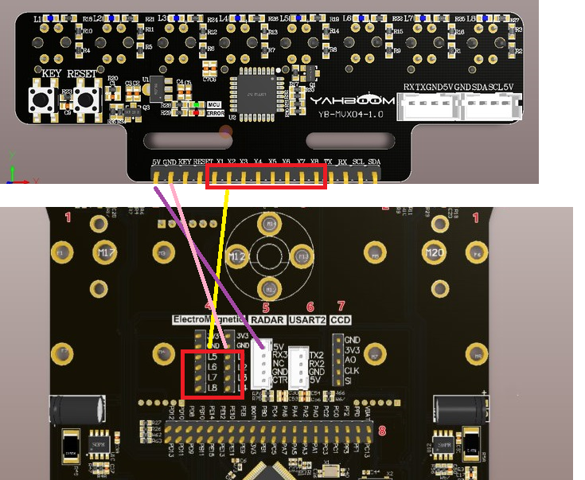

# STM32开发板小车

## 1.实验准备
1. 知识储备
- 具有有良好的编程能力(主要是C语言)
- 对stm32的架构比较熟悉

2. 材料准备
- STM32开发板小车 *1
- 八路循迹模块 *1
- 7.4V电池 *1
- 杜邦线若干

## 2.小车接线
把小车组装好后，电机线接好(黑色头接电机，白色头接开发板)




 
**开发板和红外传感器的接线 (此例程使用IO通信)**
|**开发板**|   红外传感器   |
|:-----------:|:-------------:|
|    L1      |     X1      |
|    L2      |     X2      |
|    L3      |     X3      |
|    L4      |     X4      |
|    L5      |     X5      |
|    L6      |     X6      |
|    L7      |     X7      |
|    L8      |     X8      |
|    5V      |     5V      |
|    GND     |     GND     |

如图所示




 
 

**温馨提醒：如果接8路模块后，电池盖子合不上，可以把电池固定在上方，不合电池的盖子了。**


## 主要程序
```C
// TIM6中断
void TIM6_IRQHandler(void)
{
	if (TIM_GetITStatus(TIM6, TIM_IT_Update) != RESET) //检查TIM更新中断发生与否
	{
		TIM_ClearITPendingBit(TIM6, TIM_IT_Update);    //清除TIMx更新中断标志
		
		if(timer_delay_cnt != 0)
		{
			timer_delay_cnt --;
		}
		
			//编码器pid
			Encoder_Update_Count();
			Motion_Handle();
		
		//IO直接巡线  10ms检测一下线的状态
		LineWalking();
	}
}
```
此工程使用了定时器中断去根据红外探头的的值(每10ms)，进行巡线的PID处理,从而能在黑线白底的地图是完成巡线。

在app_irtrackin.c里面有一个调节pid巡线的参数，如果想要增加或减少速度 优化效果，可以调节里面的宏定义值
```C

#define IRTrack_Trun_KP (490) //P
#define IRTrack_Trun_KI (0.0001) //I
#define IRTrack_Trun_KD (5) //D

#define IRR_SPEED 			  400  //巡线速度
```
- IRTrack_Trun_KP:pid巡线的P值
- IRTrack_Trun_KI：pid巡线的I值
- IRTrack_Trun_KD：pid巡线的D值
- IRR_SPEED：巡线的速度


**当要检测电机接线是否正确，可以给一个正值速度，然后巡线PID的值置0**，如果接线正确，按下RCT6开发板上的key按键后，小车是会往前跑的，4个电机都会往前。

## 实验现象：
在确保接线和安装无误的前提下，8路巡线模块进行的校准后，按下key1的按键就能开始巡线了。
**如果8路模块探头还无法正常检测黑白线，需要等待模块正常工作后，再按下key1键**
**如果地板是黑色的，需要把一张白纸放到我们的地图下方，盖住黑色，主要原因是地图的材质比较透光，对8路巡线传感器的影响较大。**
