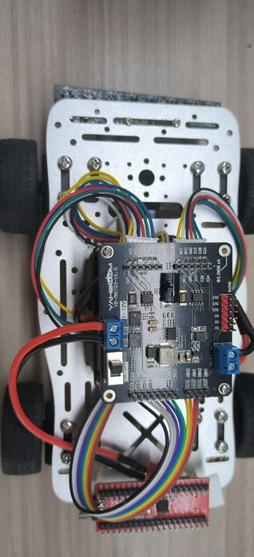

# MSPM0国赛底盘小车

[toc]

## 1.实验准备
1. 知识储备
- 具有有良好的编程能力(主要是C语言)
- 对MSPm0的架构比较熟悉

2. 材料准备
- 智能小车mini底盘 *1
- MSPM0G3507核心板 *1
- 亚博版的双路电机驱动板 *2 (其它的电机驱动板可能不适合本教程提供的源码，需自己移植)
- 八路循迹模块 *1
- 310电机 *4
- 7.4V电池 *1
- 杜邦线若干
- M3铜柱、M3螺丝若干


## 2.小车接线
把小车组装好后，如下图所示




### 2.1 MSPM0和双路驱动板接线部分
1. MSPM0G3507 和双路电机板（最上层板子）的接线
|**MSPM0G3507**|最上层双路电机板|
|:-----------:|:-------------:|
|     PA13    |      AIN1      |
|     PA12    |      AIN2      |
|     PB6     |      BIN1      |
|     PB7     |      BIN2      |
|     3V3     |      3V3      |
|     GND     |      GND      |
|     PA14    |      E1A      |
|     PA15    |      E1B      |
|     PA8     |      E2A      |
|     PA9     |      E2B      |
| 5V | 5V |

2. MSPM0G3507 和双路电机板（最下层板子）的接线
|**MSPM0G3507**|最下层双路电机板|
|:-----------:|:-------------:|
|     PA27    |      AIN1      |
|     PA26    |      AIN2      |
|     PB9     |      BIN1      |
|     PB8     |      BIN2      |
|     3V3     |      3V3      |
|     GND     |      GND      |
|     PA24     |      E1A      |
|     PA25     |      E1B      |
|     PA21     |      E2A      |
|     PA22     |      E2B      |

3. 最上层的电机驱动板子是接靠近红外传感器的两轮子的电机（即前面的电机），

   motorA--->左电机、motorB--->右电机

4. 最下层的电机驱动板子是接远离红外传感器的两轮子的电机（即后面的电机），

  motorA--->左电机、motorB--->右电机


### 2.2 MSPM0G3507和红外传感器的接线 (此例程使用IO通信)
|**MSPM0G3507**|   红外传感器   |
|:-----------:|:-------------:|
|     PA28     |       X1      |
|     PA31     |       X2      |
|     PA02     |       X3      |
|     PB24     |       X4      |
|     PB20     |       X5      |
|     PB19     |       X6      |
|     PB18     |       X7      |
|     PA07     |       X8      |
|     5V       |       5V     |
|     GND     |       GND     |

**需要MSPM0的开发把环境搭建好,才能编译运行工程**
环境搭建教程:
https://wiki.lckfb.com/zh-hans/dmx/beginner/install.html

## 主要程序
```C
int main(void)
{
    SYSCFG_DL_init();
	
	Motor_PID_Init();//电机pid初始化

	//等待红外模块正常 
	delay_ms(1000);
	delay_ms(1000);
	delay_ms(1000);
	delay_ms(1000);
	
	 //清除串口中断标志
    NVIC_ClearPendingIRQ(MYUART_INST_INT_IRQN);
    //使能串口中断
    NVIC_EnableIRQ(MYUART_INST_INT_IRQN);
	
	init_motor();//电机定时器打开

	
    while (1) 
    {    
		//使用io
		LineWalking();//巡线pid 
    }
} 

```
主函数就是根据红外探头的的值，进行巡线的PID处理,从而能在黑线白底的地图是完成巡线。

在app_irtrackin.c里面有一个调节pid巡线的参数，如果想要增加或减少速度 优化效果，可以调节里面的宏定义值
```C

#define IRTrack_Trun_KP (250) //P
#define IRTrack_Trun_KI (0) //I
#define IRTrack_Trun_KD (1) //D

#define IRR_SPEED 			  400  //巡线速度
```
- IRTrack_Trun_KP:pid巡线的P值
- IRTrack_Trun_KI：pid巡线的I值
- IRTrack_Trun_KD：pid巡线的D值
- IRR_SPEED：巡线的速度


**当要检测电机接线是否正确，可以给一个正值速度，然后巡线PID的值置0**，如果接线正确，开机等待一段时间，小车是会往前跑的，4个电机都会往前。

## 实验现象：
**如果8路模块探头还无法正常检测黑白线，需要按住MSPM0的复位键，等待模块正常工作后，再松开复位键**
在确保接线和安装无误的前提下，8路巡线模块进行的校准后，（如果使用的是教程一样的地图）需要把小车放到如下图的起点示意图下，开机等待一段时间，能开始巡线了。

**如果地板是黑色的，需要把一张白纸放到我们的地图下方，盖住黑色，主要原因是地图的材质比较透光，对8路巡线传感器的影响较大。**


