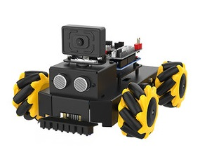

# Roboduino小车巡线

[toc]


## 1.实验准备
1. 知识储备
- 具有有良好的编程能力(主要是C语言)

2. 材料准备
- Roboduino小车 *1
- 八路循迹模块 *1
- 7.4V电池 *1
- 杜邦线若干
- M3铜柱、M3螺丝若干


## 2.小车接线
把小车组装好后，如下图所示



### 2.1 Roboduino和红外传感器的接线 (此例程使用I2C通信)
|**Roboduino**|   红外传感器   |
|:-----------:|:-------------:|
|     SDA     |       SDA      |
|     SCL     |       SCL      |
|     5V      |       5V       |
|     GND     |       GND      |


## 主要程序
```C
void setup()
{
    init_x_PID(); //PID初始化
    Serial.begin(115200);  // start serial for output
    Wire.begin();        // join i2c bus (address optional for master)

    pinMode(KEY_PIN, INPUT_PULLUP);  // 设置按键KEY引脚上拉输入模式 Set the key(button) pin to pull-up input mode
    delay(100);

    while (getKeyState(KEY_PIN) != Press_KEY) ;//按下key1开始巡线

    Motor_init();//电机初始化

}


void loop() 
{
  I2Cdata();
  Car_line_track();

}
```
主函数就是根据红外探头的的值，进行巡线的PID处理,从而能在黑线白底的地图是完成巡线。

在line_pid.cpp里面有一个调节pid巡线的参数，如果想要增加或减少速度 优化效果，可以调节里面的宏定义值
```C

#define KPx  (15) //P
#define KIx  (0.0001) //I
#define KDx  (1) //D

#define Speed_Line (30) //巡线的速度
```
- KPx:pid巡线的P值
- KIx
- KDx
- Speed_Line：巡线的速度


# 实验现象：
在确保接线和安装无误的前提下，8路巡线模块进行的校准后，按下小车上key的按键就能开始巡线了。
**如果8路模块探头还无法正常检测黑白线，需要等待模块正常工作后，再按下小车上key键**
