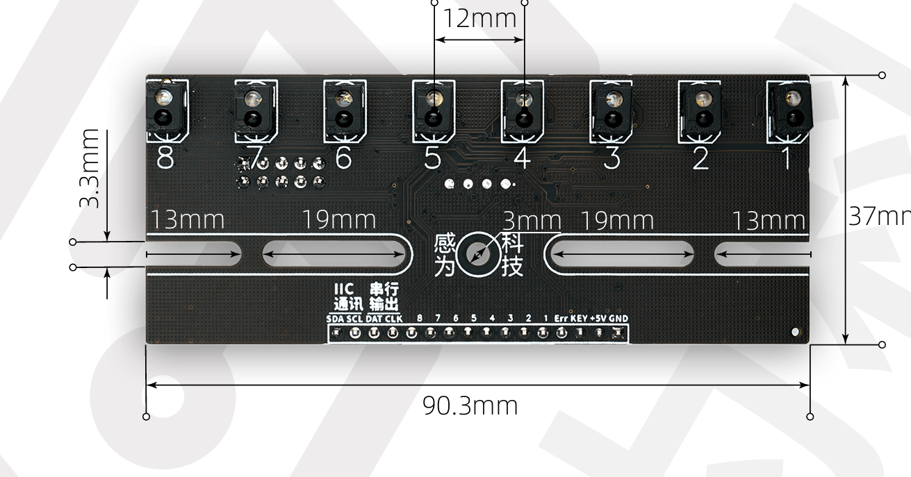

# 小车硬件说明书

## 两轴四轮小车

- 有文件资料

## 两轮差速小车

## 智博八路红外传感器

- 有文件资料

## 感为八路灰度传感器

https://www.ganv.com.cn/grayscale_8ways.html

## 正点原子陀螺仪

- 有文件资料

http://www.openedv.com/docs/modules/other/ATK-IMU901.html

## JY61P陀螺仪

https://wit-motion.yuque.com/wumwnr/docs/np25sf?singleDoc#%20%E3%80%8AJY61P%E4%BA%A7%E5%93%81%E8%B5%84%E6%96%99%E3%80%8B

## 电机驱动板 TB6612

https://www.bilibili.com/opus/1014716449230422018

- 有文件资料
- 
- 

## 有源蜂鸣器

## 超声波测距

HC-SR04老款5V **使用说明：**https://www.bilibili.com/opus/1059650981214552069

HR-SR04资料下载链接：https://pan.baidu.com/s/1fNaKi_MOijhhqckngIdQWw?pwd=8888 

## 红外对光管

- 无遮挡物时，开关处于断开状态（常开）

## K230视觉模块

官方资料：https://wiki.01studio.cc/docs/canmv_k230

自购资料：https://pan.baidu.com/s/1EFF69ZOWOsTcHCSDNlqptg?pwd=7hj4

## 面包板 

以较长边为x轴，较短边为y轴，则x轴为断路，y轴为通路

## 小车机械尺寸

- 轮胎：直径48mm，轮距130mm
- 灰度传感器传感部分距离两轮中心垂直距离为195mm
